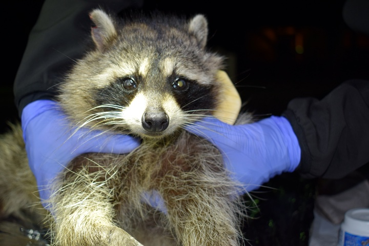

# EXPERIENCES

## Social dynamics - 3 years project

## Wildelife management - 9 months project

{ width=50% }

## Predator-prey interactions - 5 months project
More [here](https://mablab.org/people/romain-dejeante/)

{ width=50% }